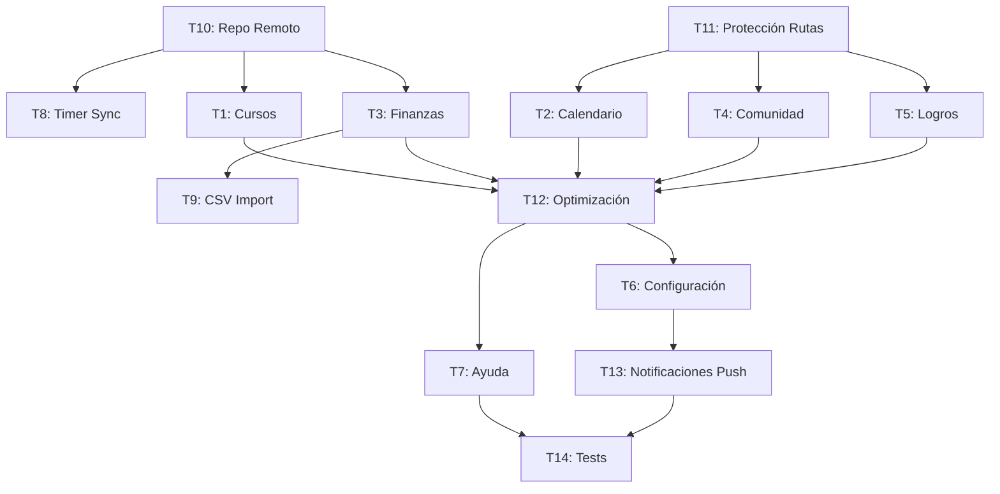

# Plan Detallado - Prosper-Pro

## Nota: Revisión de subplanes
- Se ha creado el archivo `plans/ISSUES_AND_OPTIMIZATIONS.md` para registrar problemas técnicos y optimizaciones detectados en tiempo de ejecución.
- Consultar dicho archivo antes de comenzar cada nueva tarea.

## Arquitectura Actual

```
Prosper-Pro (Next.js 16 + App Router)
├── app/
│   ├── layout.tsx              → Root layout con AuthProvider
│   ├── page.tsx                → Dashboard (ProtectedRoute)
│   ├── globals.css             → Design tokens + temas
│   ├── login/page.tsx          → Login (Google + Email)
│   ├── register/page.tsx       → Registro
│   ├── metas/page.tsx          → CRUD de metas
│   └── components/             → Componentes compartidos
│       ├── Dashboard.tsx       → Widget principal
│       ├── DashboardLayout.tsx → Layout con Sidebar + Topbar
│       ├── Sidebar.tsx         → Navegación (9 rutas)
│       ├── Topbar.tsx          → Barra superior
│       ├── ProtectedRoute.tsx  → Protección de rutas
│       └── ThemeProvider.tsx   → Tema claro/oscuro
├── lib/
│   ├── firebase.ts             → Init Firebase (auth, db)
│   ├── seed.ts                 → Datos iniciales
│   ├── contexts/AuthContext.tsx→ Contexto auth
│   └── firestore/              → 8 módulos
│       ├── goals.ts            → CRUD metas
│       ├── transactions.ts     → Transacciones + weekly data
│       ├── users.ts            → Perfiles
│       ├── gamification.ts     → XP + logros
│       ├── reminders.ts        → Recordatorios
│       ├── notifications.ts    → Notificaciones
│       ├── community.ts        → Miembros comunidad
│       └── study.ts            → Timer estudio
└── types/index.ts              → Interfaces TypeScript
```

---

## Plan de Tareas Detallado

### FASE 1: Infraestructura y Correcciones (Día 1)

#### T10: Configurar Repositorio Remoto
**Archivos afectados:** `.gitignore`, git config
**Pasos:**
1. Verificar estado actual de git (`git status`)
2. Crear repositorio en GitHub/GitLab
3. `git remote add origin <url>`
4. `git push -u origin master`
**Dependencias:** Ninguna
**Riesgo:** Bajo

#### T8: Sincronizar Timer de Estudio con Firestore
**Archivos a modificar:** `app/components/Dashboard.tsx`, `lib/firestore/study.ts`
**Pasos:**
1. Agregar `useEffect` que guarde cada 30s con `saveStudyTimer`
2. Al pausar/detener → guardar inmediatamente
3. Al desmontar componente → guardar estado actual
4. Manejar caso de usuario no autenticado (skip)
**Dependencias:** T10 (recomendado)
**Riesgo:** Bajo

---

### FASE 2: Features Principales (Días 2-4)

#### T1: Módulo de Cursos - Academia Prosper
**Archivos a crear:**
- `app/cursos/page.tsx` → Página principal
- `app/cursos/[id]/page.tsx` → Detalle de curso
- `lib/firestore/courses.ts` → Módulo Firestore

**Nuevas interfaces en `types/index.ts`:**
```typescript
export interface Course {
  id: string;
  title: string;
  description: string;
  modules: CourseModule[];
  thumbnail: string;
  category: string;
  xpReward: number;
}

export interface CourseModule {
  id: string;
  title: string;
  content: string;
  duration: number; // minutos
  completed: boolean;
}

export interface UserCourseProgress {
  userId: string;
  courseId: string;
  completedModules: string[];
  startedAt: number;
  completedAt?: number;
}
```

**Funciones en `lib/firestore/courses.ts`:**
- `subscribeToCourses(callback)` → Lista de cursos disponibles
- `subscribeToUserProgress(userId, callback)` → Progreso del usuario
- `completeModule(userId, courseId, moduleId)` → Marcar módulo completado
- `getCourseById(courseId)` → Obtener curso específico

**UI:**
- Grid de tarjetas de cursos con progreso
- Vista de detalle con módulos expandibles
- Barra de progreso por curso
- Badge de XP reward

**Dependencias:** T10
**Riesgo:** Medio

#### T3: Página de Finanzas
**Archivos a crear:**
- `app/finanzas/page.tsx` → Página principal
- `lib/csvParser.ts` → Parser CSV (compartido con T9)

**Funciones nuevas en `lib/firestore/transactions.ts`:**
- `createTransaction(transaction)` → Agregar transacción
- `deleteTransaction(transactionId)` → Eliminar
- `getTransactionsByCategory(userId, category)` → Filtrar
- `getMonthlySummary(userId)` → Resumen mensual

**UI:**
- Tabla de transacciones con filtros (tipo, categoría, fecha)
- Gráfico de barras: ingresos vs gastos por mes
- Resumen: total ingresos, gastos, ahorro del mes
- Botón "Agregar transacción" con modal

**Dependencias:** T10
**Riesgo:** Medio

---

### FASE 3: Páginas Secundarias (Días 5-7)

#### T2: Página de Calendario
**Archivos a crear:**
- `app/calendario/page.tsx`
- `app/components/CalendarView.tsx`

**Funciones nuevas en `lib/firestore/reminders.ts`:**
- `createReminder(reminder)`
- `updateReminder(reminderId, updates)`
- `deleteReminder(reminderId)`

**UI:**
- Vista mensual con navegación
- Indicadores de eventos por día
- Modal para crear/editar recordatorio
- Integración con reminders existentes

**Dependencias:** Ninguna
**Riesgo:** Medio (complejidad de UI de calendario)

#### T9: Importar CSV
**Archivos a modificar:** `app/components/Dashboard.tsx`, `lib/csvParser.ts`
**Pasos:**
1. Crear `lib/csvParser.ts` con función `parseCSV(file)`
2. Formato esperado: `date,amount,type,category,description`
3. Modificar modal "Importar Datos" para leer archivo
4. Crear transacciones en Firestore en lote
5. Mostrar preview antes de importar

**Dependencias:** T3 (comparte lib/csvParser.ts)
**Riesgo:** Bajo

#### T11: Mejorar Protección de Rutas
**Archivos a modificar:** `app/layout.tsx`, `app/components/ProtectedRoute.tsx`
**Opción A: Layout protegido**
- Crear `app/(dashboard)/layout.tsx` con ProtectedRoute
- Mover todas las páginas del dashboard bajo `(dashboard)/`

**Opción B: Middleware**
- Crear `middleware.ts` en raíz
- Redirigir a `/login` si no autenticado

**Recomendación:** Opción A (más simple, sin edge functions)

**Dependencias:** Ninguna
**Riesgo:** Bajo

---

### FASE 4: Páginas de Contenido (Días 8-10)

#### T4: Página de Comunidad
**Archivos a crear:** `app/comunidad/page.tsx`
**Funciones nuevas en `lib/firestore/community.ts`:**
- `inviteMember(email)` → Enviar invitación
- `getLeaderboard()` → Ranking de usuarios

**UI:**
- Lista de miembros con estado
- Ranking por XP/nivel
- Actividad reciente
- Botón invitar miembros

**Dependencias:** Ninguna
**Riesgo:** Bajo

#### T5: Página de Logros
**Archivos a crear:** `app/logros/page.tsx`
**Funciones nuevas en `lib/firestore/gamification.ts`:**
- `getAllAchievements()` → Lista completa de logros disponibles
- `subscribeToUserAchievements(userId, callback)`

**UI:**
- Grid de logros (desbloqueados vs bloqueados)
- Filtros por categoría
- Animación de desbloqueo
- Progreso hacia siguiente logro

**Dependencias:** Ninguna
**Riesgo:** Bajo

#### T12: Optimización de Rendimiento
**Archivos a modificar:** Varios
**Pasos:**
1. Lazy loading para gráficos pesados (`next/dynamic`)
2. Optimizar imágenes de logo (usar `next/image`)
3. Code splitting por ruta
4. Revisar imports de Firestore (usar dynamic imports)

**Dependencias:** Todas las páginas creadas
**Riesgo:** Medio

---

### FASE 5: Páginas de Soporte (Días 11-12)

#### T6: Página de Configuración
**Archivos a crear:** `app/configuracion/page.tsx`
**Funciones nuevas en `lib/firestore/users.ts`:**
- `updateUserProfile(userId, updates)`
- `deleteUserAccount(userId)` → Requiere Firebase Admin

**UI:**
- Formulario de perfil (nombre, foto, email)
- Toggle tema claro/oscuro
- Toggle notificaciones
- Botón eliminar cuenta (con confirmación)

**Dependencias:** Ninguna
**Riesgo:** Medio (eliminar cuenta es complejo)

#### T7: Página de Ayuda
**Archivos a crear:** `app/ayuda/page.tsx`
**UI:**
- FAQ con acordeón
- Guía de uso
- Formulario de contacto
- Link a tutorial

**Dependencias:** Ninguna
**Riesgo:** Bajo

---

### FASE 6: Extras (Días 13-14)

#### T13: Notificaciones Push
**Archivos a crear:** `lib/notifications.ts`, `public/sw.js`
**Pasos:**
1. Solicitar permiso de notificaciones
2. Registrar service worker
3. Escuchar cambios en Firestore (reminders, logros)
4. Mostrar notificación del navegador

**Dependencias:** T6 (configuración de notificaciones)
**Riesgo:** Alto (compatibilidad de navegadores)

#### T14: Tests Básicos
**Dependencias a instalar:** `@testing-library/react`, `jest`, `@testing-library/jest-dom`
**Archivos a crear:**
- `__tests__/firestore/goals.test.ts`
- `__tests__/components/Dashboard.test.tsx`
- `__tests__/components/Auth.test.tsx`

**Dependencias:** Todas las features completadas
**Riesgo:** Medio

---

## Diagrama de Dependencias



## Priorización Final

| Orden | Tarea | Prioridad | Complejidad |
|-------|-------|-----------|-------------|
| 1 | T10: Repo Remoto | Alta | Baja |
| 2 | T8: Timer Sync | Alta | Baja |
| 3 | T1: Cursos | Alta | Media |
| 4 | T3: Finanzas | Alta | Media |
| 5 | T9: CSV Import | Media | Baja |
| 6 | T11: Protección Rutas | Media | Baja |
| 7 | T2: Calendario | Media | Media |
| 8 | T4: Comunidad | Media | Baja |
| 9 | T5: Logros | Media | Baja |
| 10 | T12: Optimización | Media | Media |
| 11 | T6: Configuración | Baja | Media |
| 12 | T7: Ayuda | Baja | Baja |
| 13 | T13: Notificaciones | Baja | Alta |
| 14 | T14: Tests | Baja | Media |
